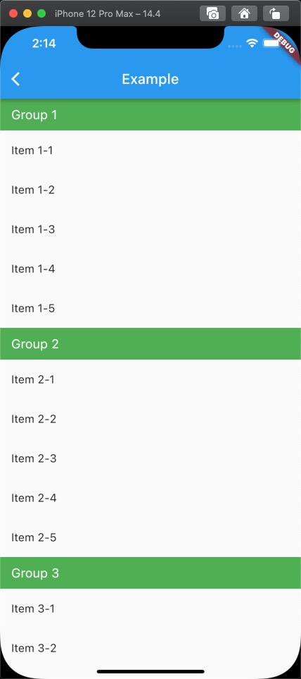

<!-- 
This README describes the package. If you publish this package to pub.dev,
this README's contents appear on the landing page for your package.

For information about how to write a good package README, see the guide for
[writing package pages](https://dart.dev/guides/libraries/writing-package-pages). 

For general information about developing packages, see the Dart guide for
[creating packages](https://dart.dev/guides/libraries/create-library-packages)
and the Flutter guide for
[developing packages and plugins](https://flutter.dev/developing-packages). 
-->

Notice: 2.0.0 has break changing
- The header sticky will use flutter_list_view to implement
- Refresh control will construct by user, like pull_to_refresh

```dart
SectionView<AlphabetHeader<CountryModel>, CountryModel>(
  source: _filterCountries,
  onFetchListData: (header) => header.items,
  enableSticky: true,
  alphabetAlign: Alignment.center,
  alphabetInset: const EdgeInsets.all(4.0),
  headerBuilder: getDefaultHeaderBuilder((d) => d.alphabet),
  alphabetBuilder: getDefaultAlphabetBuilder((d) => d.alphabet),
  tipBuilder: getDefaultTipBuilder((d) => d.alphabet),
  refreshBuilder: (child) {
    return SmartRefresher(
        enablePullDown: true,
        enablePullUp: false,
        header: const WaterDropHeader(),
        controller: _refreshController,
        onRefresh: _onRefresh,
        child: child);
  },
  itemBuilder:
      (context, itemData, itemIndex, headerData, headerIndex) {
    return Padding(
      padding: const EdgeInsets.only(right: 12.0),
      child: ListTile(
          title: Text(itemData.name),
          trailing: Text(itemData.phoneCode)),
    );
  },
),
```

## Features

1. Show with section view
2. Alphabet support
3. Refresh support

## Screen

|  | | |
| :-----:| :----: | :----: |
|  |  |  |

## Usage

Firstly, you can construct data like

```dart
List<GroupModel> data = [
    GroupModel(name: "Group 1", items: [
      ItemModel(name: "Item 1-1"),
      ItemModel(name: "Item 1-2"),
      ItemModel(name: "Item 1-3"),
      ItemModel(name: "Item 1-4"),
      ItemModel(name: "Item 1-5"),
    ]),
    GroupModel(name: "Group 2", items: [
      ItemModel(name: "Item 2-1"),
      ItemModel(name: "Item 2-2"),
      ItemModel(name: "Item 2-3"),
      ItemModel(name: "Item 2-4"),
      ItemModel(name: "Item 2-5"),
    ]),
    GroupModel(name: "Group 3", items: [
      ItemModel(name: "Item 3-1"),
      ItemModel(name: "Item 3-2"),
      ItemModel(name: "Item 3-3"),
      ItemModel(name: "Item 3-4"),
      ItemModel(name: "Item 3-5"),
    ]),
  ];
```
After that, you can put code into you project like as below
```dart
SectionView<GroupModel, ItemModel>(
  source: data,
  onFetchListData: (header) => header.items,
  headerBuilder: getDefaultHeaderBuilder((d) => d.name,
      bkColor: AppColor.green,
      style:
          const TextStyle(fontSize: 18, color: Colors.white)),
  itemBuilder:
      (context, itemData, itemIndex, headerData, headerIndex) =>
          ListTile(
            title: Text(itemData.name),
          )),
```

## Additional information

If you want to custom your UI, please follow /example/lib/fullSectionList.dart

## Todo
- Provide tailer load more functionality
- Provide programaticly invoke onRefresh.
